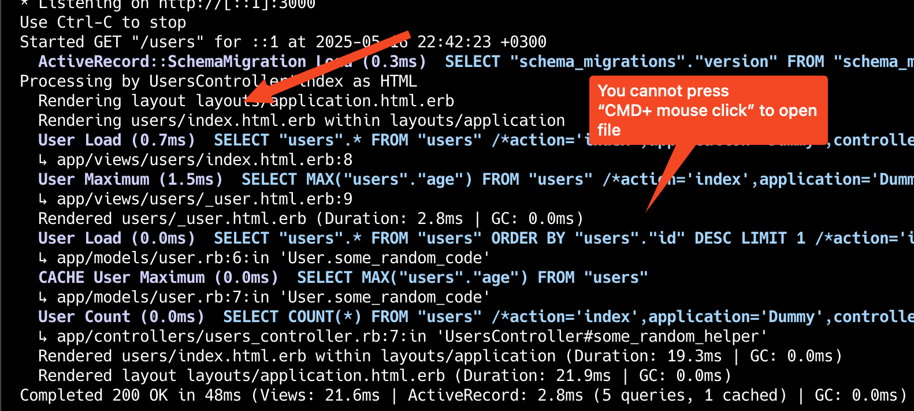
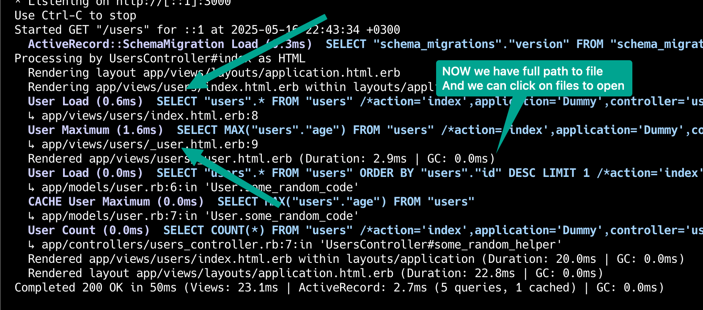

# ClickableLogger

Increase your productivity in 30 seconds.

ClickableLogger is a Rails logger formatter that makes it easy to navigate to the code from the logs.

And now you can click "Cmd+Click" on the log message to open the file in your editor.

## Before & After

Before:



After:



## Usage

30 seconds to get started:

1. Install the gem
2. Generate the initializer
3. Start the server


## Installation
Add this line to your application's Gemfile:

```ruby
gem "clickable_logger", group: :development
```

And then execute:
```bash
$ bundle
```

## Configuration

```bash
rails g clickable_logger:install
```

This will create a `config/initializers/clickable_logger.rb` file.

## Advanced Usage

#### Using with Sidekiq

To keep default behavior, and not to print logs to the console, we have to set `LOGGER` environment variable to any value.

Example how to run: `LOGGER=true bundle exec sidekiq`

With this configuration, sidekiq will print the log to the console and make it (path to views) clickable.

```ruby
# config/initializers/sidekiq.rb

Sidekiq.configure_server do |config|
  # config.redis = {
  #   url: ENV["REDIS_URL"],
  #   ssl_params: { verify_mode: OpenSSL::SSL::VERIFY_NONE },
  # }

  if Rails.env.development? && ENV["LOGGER"].present?
    stdout_logger = ActiveSupport::TaggedLogging.new(Logger.new($stdout))
    stdout_logger.formatter.class.send(:prepend, ClickableLogger::Formatter)
    stdout_logger.level = Logger::DEBUG

    config.logger = Rails.logger.dup
    config.logger.level = Logger::DEBUG
    config.logger.broadcast_to(stdout_logger)
  end
end

# Sidekiq.configure_client do |config|
#   # ....
# end
```

### When clickable logger doesnt work because of other gems

In the initializer replace code with this one:

```ruby
if defined?(ClickableLogger)
  Rails.application.config.after_initialize do
    if Rails.logger&.formatter
      Rails.logger.formatter.class.send(:prepend, ClickableLogger::Formatter)
    end
  end
end
```

## Testing

Run tests with:
```bash
bin/test
```

## Contributing

You are welcome to contribute to the project.

Some ideas:

- more matchers
- more tests

## License
The gem is available as open source under the terms of the [MIT License](LICENSE.txt).
